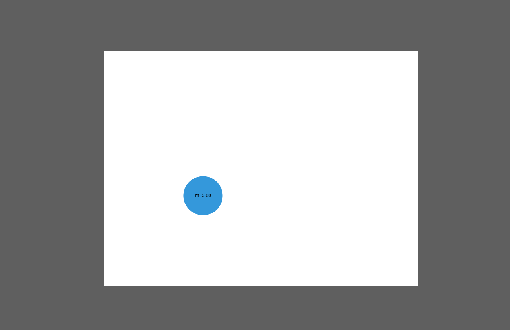

# Bouncing Ball Physics

> [!WARNING]
> This is a work In Progress! Anything can change at any moment without any notice!

Realistic physics implementation of a bouncing ball.



## Quick Start

```console
$ npm install
$ npm run serve
$ <browser> https://localhost:8080
```

This script starts up http-server at http://localhost:8080/ to serve the content of the current
folder

## References

- Physics implementation is heavily inspired from the book: "_Game Physics Engine Development by Ian
  Millington_"
